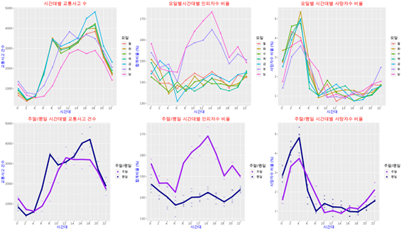
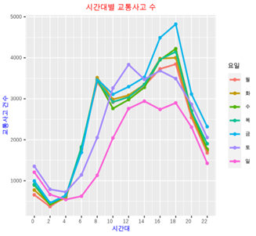
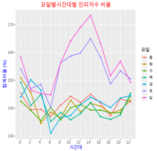
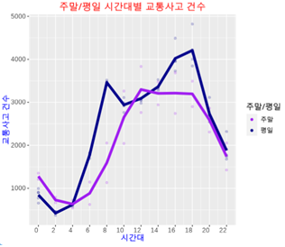
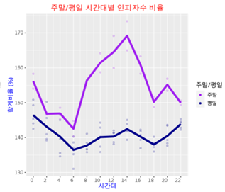
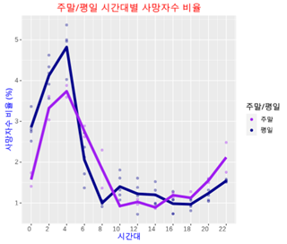
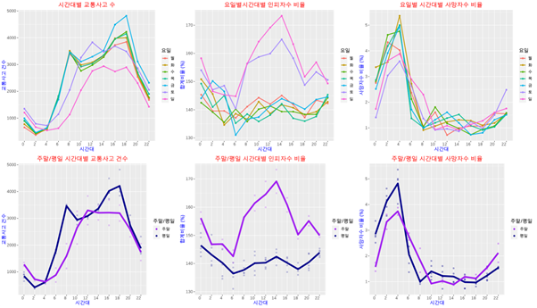

## 요일별, 시간대별 교통사고 분석 및 정책 제안

### 개요

이 프로젝트는 도로교통공단의 데이터를 활용하여 요일별, 시간대별 교통사고 발생 패턴과 그 심각성을 분석하고, 이를 바탕으로 실질적인 정책 제안을 제시하는 것을 목표로 합니다.

### 데이터 출처

* 도로교통공단, "요일별 시간대별 교통사고 통계" ([https://www.data.go.kr/data/15070312/fileData.do](https://www.data.go.kr/data/15070312/fileData.do))

### 분석 내용

* **교통사고 발생 건수 분석:** 요일별, 시간대별 교통사고 발생 건수를 시각화하여 패턴 분석
* **인명 피해 심각성 분석:** 사고 건수 대비 인명 피해자 수 및 사망자 수 비율을 분석하여 사고의 심각성 파악
* **평일/주말 비교 분석:** 평일과 주말의 교통사고 발생 패턴 및 심각성 비교

* **출력결과**

* **해석**
 요일별 시간대별 교통사고의 절대적인 양을 파악하기 위해 교통사고수를 시각화하고, 사고 당 다치고 죽는 사람들 수의 흐름을 알기위해 인피자수 비율을 시각화하며, 세부적으로 목숨을 잃게 되는 경우까지 사고 당 사망자수비율을 시각화합니다.

먼저 요일별 시간대별 교통사고 수를 시각화하였습니다. 
다음날 주말인 금요일 18시에 사고건수가 가장 많았습니다.
다음날 평일인 일요일 2시에 사고건수가 가장 적었습니다.
전체적으로 오전6시부터 오후6시 시간대까지 증가하였다 취침시간대에 감소하는 양상을 보입니다.  요일별로 평일과 주말에 따라 비슷한 양상을 보이는 것을 알 수 있습니다. 

요일별 시간대별 사고건수대비 인피자수 비율을 시각화하였습니다. 
사람 많은 주말, 일요일 14시에 사고 당 인피사고자수가 가장 많았습니다. 
금요일 아침 6시에 비율이 가장 낮았습니다.
주말과 평일에 따라 그래프양상이 유사합니다.

요일별 시간대별 사망자수비율을 비율을 시각화 하였습니다.
월요일 12시, 수목 16시에 사망자수비율이 가장 낮았고, 화요일 오전 4시시간대에 사망자수 비율이 가장 높았습니다. 
전체적으로 일출부터 일몰까지 낮았다 일몰시부터 일출시간대까지 급격하게 증가합니다. 
평일과 주말인 요일은 서로 비슷한 양상을 띄고있습니다.

요일별 기준 시각화시 주말과 평일, 서로의 유사성을 파악하여 주말과 평일의 요일별 평균치를 계산하여 시각화하였습니다.

주말과 평일 시간대별 교통사고건수를 그래프로 나타내어보면 
공통적으로 사람들의 유동이 많은 일출시부터 일몰시까지 사고건수가 많다는 것을 알 수 있습니다.
그러나, 평일은 사람들의 출퇴근시간에 사고건수가 급격하게 증가하는 것을 알 수 있습니다. 주말은 점심시간에 사고수가 평일보다 높다는 것을 알 수 있습니다.

절대적인 사고건수는 사람들의 출퇴근과 ,일상에 따라 정해지는 유동인구에 따라 큰 영향을 받는 것으로 해석할 수 있습니다. 

시간대별 사고당 인피자수 비율을 주말과 평일에 따라 나누어 보면
공통적으로 100%이상 인피자가 있고, 자정부터 6시, 일출시간대 까지는 꾸준히 줄어듭니다. 6시부터 14시 시간대 까지는 증가하고, 18시 시간대까지는 감소합니다.
그러나, 주말이 평일 보다 전체적으로 사고당 인피자수 비율이 평일보다 높았고, 6시부터 14시 시간대까지의 비율증가가 평일보다 극단적으로 높습니다.

인피자수비율의 시각화는 대체적으로 약속이나 모임 등 만남이 많은 주말 일상 동안에 사고건수 당 다수가 다치거나 죽을 수 있다는 것으로 해석할 수 있습니다.

시간대별 사고당 사망자수 비율을 주말과 평일에 따라 나누어 보면 공통적으로 일출시부터 일몰시 시간대까지 낮고, 일몰시부터 증가하여 새벽2시에서 4시 시간대까지 가장 높습니다.
그러나 평일 새벽에 사망자가 생기는 비율이 더 높고, 주말 6시-8시까지 평일보다 높고, 10시-14시 시간대까지 평일이 더 높고, 16시-0시까진 주말이 더 높다는 것을 알 수 있습니다.

사망자수비율의 시각화는 대체적으로 유동인구가 적은 새벽시간대에 사망자가 생길 가능성이 높다는 것을 알 수 있습니다. 주말과 평일의 차이도 유동인구의 차이로 인한 것으로 유추해석해 볼 수 있습니다.

### 주요 결과

* **교통사고 발생:** 금요일 저녁 시간대에 가장 많이 발생하며, 일요일 새벽 시간대에 가장 적게 발생
* **인명 피해:** 주말 낮 시간대에 사고당 인명 피해 비율이 가장 높음
* **사망 사고:** 새벽 시간대에 사망 사고 비율이 가장 높으며, 평일 새벽 시간대의 사망률이 주말보다 높음

### 정책 제안

* **평일:** 출퇴근 시간대 교통경찰 순찰 및 교통지도 강화
* **주말:** 낮과 저녁 시간대 구급차 배치 증가
* **새벽:** 외진 곳 및 유동 인구 적은 곳 CCTV 모니터링 강화 및 추가 설치, 순찰 강화

### 사용 기술

* R
* ggplot2
* tidyverse
* showtext

### 실행 방법

1. R 및 필요한 패키지 설치
2. 데이터 다운로드 및 경로 설정
3. R 코드 실행
4. 분석 결과 및 시각화 자료 확인

### 기여 방법

* 이슈 제기 및 개선 제안 환영
* 추가 분석 및 시각화 아이디어 제시
* 코드 개선 및 오류 수정

### 라이선스

MIT License

**참고:** 본 분석은 도로교통공단의 공공 데이터를 활용하였으며, 분석 결과는 참고용으로 활용되어야 합니다. 정책 결정 시에는 다양한 요소를 종합적으로 고려해야 합니다. 
